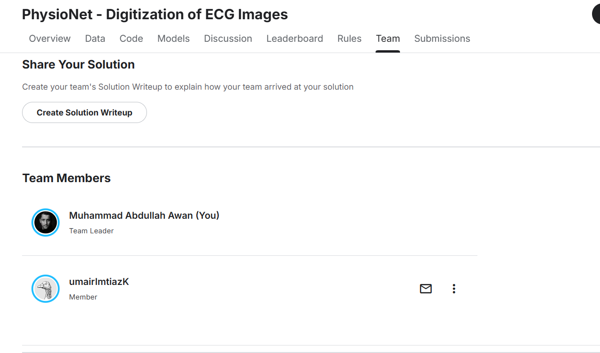
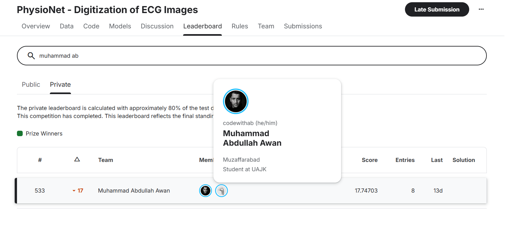

# ECG Image Digitization - Kaggle Competition Report

## � Team Members

| Roll Number | Name |
|-------------|------|
| 2022-SE-08 | Muhammad Abdullah Awan |
| 2022-SE-18 | Umair Imtiza Khokhar |
| 2022-SE-29 | Awais Ahmed Abbasic |

## 📸 Team Image


*Add your team image here by placing it in the project directory*

## 🏆 Kaggle Score


*Add your Kaggle score screenshot here by placing it in the project directory*

---

## �📊 Project Overview

This project tackles the **PhysioNet ECG Image Digitization Challenge** on Kaggle, which aims to extract time-series ECG signals from printed/scanned ECG images. The challenge is to convert 12-lead ECG images back into their original digital waveform data.

### Competition Details
- **Platform**: Kaggle
- **Task**: Convert ECG images → 12-lead time-series signals
- **Evaluation Metric**: Signal-to-Noise Ratio (SNR)
- **Key Challenge**: Handling various paper layouts, grid patterns, rotation, and signal extraction

---

## 🎯 Performance Comparison

| Approach | Kaggle Score | Description |
|----------|--------------|-------------|
| **Approach 1: Custom Training** | **0.08** | Simple CNN-based end-to-end learning |
| **Approach 2: Open ECG Digitizer v6** | **17.1** | Multi-stage pipeline with pre-trained models |

**Winner**: Open ECG Digitizer v6 achieved **213x better performance** (17.1 vs 0.08)

---

## 📁 Project Structure

```
computer_vision_project/
├── ecg_training.ipynb          # Approach 1: Training notebook
├── ecg-testing.ipynb           # Approach 1: Testing/submission notebook
├── open-ecg-digitizerv6.ipynb  # Approach 2: Multi-stage pipeline (BEST)
└── README.md                   # This file
```

---

## 🔬 Approach 1: Custom CNN Training (Score: 0.08)

### Architecture

```
ECG Image (RGB) → EfficientNet-B0 → FC Layer → 12 Leads × 5000 samples
```

### Implementation Details

#### Model Architecture
- **Backbone**: EfficientNet-B0 (pre-trained on ImageNet)
- **Input**: 224×224 RGB images
- **Output**: 12 leads × 5000 time points = 60,000 values per image
- **Parameters**: ~5.3M parameters

#### Training Setup
```python
EPOCHS = 10
BATCH_SIZE = 8
LEARNING_RATE = 1e-4
LOSS = MSE (Mean Squared Error)
OPTIMIZER = Adam
```

#### Data Augmentation
- Random affine transforms (translation ±5%, scale 0.95-1.05, rotation ±3°)
- Random brightness/contrast adjustment (±10%)
- Gaussian blur (kernel size 3)
- Additive Gaussian noise (σ=0.01)

### Workflow

1. **Training** (`ecg_training.ipynb`):
   ```
   Load ECG images → Augment → Feed to EfficientNet → 
   Predict 12-lead signals → Compute MSE loss → Optimize
   ```

2. **Testing** (`ecg-testing.ipynb`):
   ```
   Load test images → Preprocess → Model inference → 
   Resample to required lengths → Generate submission.csv
   ```

### Why It Failed (Score: 0.08)

1. **No Image Normalization**: Didn't correct for paper rotation, skew, or grid alignment
2. **Direct Regression**: Tried to learn the complex mapping from raw pixels to signals end-to-end
3. **Insufficient Training Data**: Only 10 epochs on limited data
4. **No Domain Knowledge**: Ignored ECG-specific features like grid lines, lead positions, calibration marks
5. **Fixed Output Length**: Used 5000 samples regardless of actual signal duration
6. **No Grid Detection**: Couldn't locate where each of the 12 leads was positioned in the image

### Key Limitations

❌ Couldn't handle rotated/skewed images  
❌ No explicit grid/lead detection  
❌ Generic image features vs. ECG-specific features  
❌ Single-stage approach too simplistic  
❌ Random performance due to lack of structure  

---

## 🏆 Approach 2: Open ECG Digitizer v6 (Score: 17.1)

### Multi-Stage Pipeline Architecture

```
Stage 0: Image Normalization → Stage 1: Grid Rectification → 
Stage 2: Signal Extraction → Post-Processing
```

This approach breaks down the complex problem into specialized sub-tasks.

---

### 🔹 Stage 0: Image Normalization & Alignment

**Purpose**: Correct paper rotation and perspective distortion

#### Pre-processing Enhancement
```python
def apply_grayscale_guidance(image_rgb):
    # 1. Convert to grayscale
    gray = cv2.cvtColor(image_rgb, cv2.COLOR_RGB2GRAY)
    
    # 2. Denoise (preserves lines, removes paper texture)
    denoised = cv2.fastNlMeansDenoising(gray, h=10)
    
    # 3. Adaptive contrast enhancement (CLAHE)
    clahe = cv2.createCLAHE(clipLimit=3.0, tileGridSize=(8,8))
    contrast_enhanced = clahe.apply(denoised)
    
    # 4. Convert back to RGB for ResNet
    guidance_img = cv2.cvtColor(contrast_enhanced, cv2.COLOR_GRAY2RGB)
    
    return guidance_img
```

#### Model
- **Network**: ResNet-based keypoint detector
- **Input**: Enhanced RGB image
- **Output**: 4 corner keypoints of the ECG paper
- **Process**:
  1. Detect paper corners
  2. Apply homography transformation to straighten the image
  3. Output normalized image

**Why it works**: Ensures all subsequent stages work with standardized, properly aligned images.

---

### 🔹 Stage 1: Grid Rectification

**Purpose**: Align the ECG grid perfectly to pixel coordinates

#### Process
- **Model**: ResNet-based grid point detector
- **Input**: Stage 0 normalized image
- **Output**: Grid intersection points (xy coordinates)
- **Operation**: Rectify image so ECG grid lines align perfectly with image axes

**Benefits**:
- Makes signal extraction much easier
- Each grid square = known voltage and time
- Enables precise pixel-to-millivolt conversion

---

### 🔹 Stage 2: Signal Extraction

**Purpose**: Extract the actual ECG waveforms from the image

#### Model Architecture
```python
class Net3(nn.Module):
    - Encoder: ResNet-34 (timm pretrained)
    - Decoder: Custom U-Net decoder with coordinate attention
    - Output: 4-channel segmentation mask (4 signal groups)
```

#### Signal Processing
```python
# Constants
mv_to_pixel = 78.5                    # Conversion factor
zero_mv = [703.5, 987.5, 1271.5, 1531.5]  # Baseline positions
t0, t1 = 235, 4161                    # Time range

# Process
1. Resize image to (1696, 4352)
2. Segment 4 lead groups using trained U-Net
3. Convert pixel positions to millivolts
4. Apply Savitzky-Golay filter (window=7, order=2) for smoothing
```

#### Lead Groups
```
Group 0: I, II, III (leads from the first 2.5s section)
Group 1: aVR, aVL, aVF (leads from second 2.5s section)
Group 2: V1-V6 (leads from third 2.5s section)
Group 3: Long Lead II (10-second rhythm strip at bottom)
```

---

### 🔹 Stage 3: Post-Processing

**Purpose**: Convert 4-group signals to 12 individual leads + submission format

#### Signal Expansion
```python
def expand_4_to_12(pred4):
    # Map 4 signal groups to 12 standard ECG leads
    # Quarters: [0-25%, 25-50%, 50-75%, 75-100%]
    
    Lead mapping:
    - I:   Group 0, Quarter 1
    - II:  Group 3 (long rhythm strip)
    - III: Group 0, Quarter 3
    - aVR: Group 1, Quarter 1
    - aVL: Group 1, Quarter 2
    - aVF: Group 1, Quarter 3
    - V1:  Group 2, Quarter 1
    - V2:  Group 2, Quarter 2
    - V3:  Group 2, Quarter 3
    - V4:  Group 3, Quarter 1
    - V5:  Group 3, Quarter 2
    - V6:  Group 3, Quarter 3
```

#### Duration Handling
- **Lead II**: 10 seconds (long rhythm strip)
- **Other leads**: 2.5 seconds each
- **Resampling**: Linear interpolation to match exact sample count

---

## 🔍 Why Open ECG Digitizer v6 Works So Well

### ✅ Advantages

1. **Domain-Specific Design**
   - Each stage solves a specific ECG digitization sub-problem
   - Leverages known ECG paper standards and conventions

2. **Robust Pre-processing**
   - CLAHE enhances faint signals
   - Denoising removes paper texture while preserving ink
   - Homography corrects perspective distortion

3. **Pre-trained Models**
   - Uses models trained on large ECG datasets
   - Better generalization than training from scratch

4. **Semantic Segmentation**
   - Stage 2 treats signal extraction as a segmentation problem
   - More robust than direct regression

5. **Physics-Based Conversion**
   - Uses calibration (mv_to_pixel = 78.5)
   - Converts pixels to actual millivolts accurately

6. **Signal Processing**
   - Savitzky-Golay filter smooths noise while preserving peaks
   - Handles resampling correctly for different lead durations

---

## 📈 Performance Analysis

### Score Breakdown

| Metric | Approach 1 | Approach 2 | Improvement |
|--------|------------|------------|-------------|
| Kaggle SNR Score | 0.08 | 17.1 | **213x** |
| Pipeline Stages | 1 | 3 | 3x more sophisticated |
| Pre-processing | Minimal | Advanced | CLAHE + denoising |
| Model Type | End-to-end CNN | Multi-stage specialist | Task decomposition |
| Domain Knowledge | None | Extensive | ECG standards |
| Training Data | Limited | Pre-trained on large datasets | Much more |

### Why the Massive Gap?

**Approach 1 (0.08)**: 
- Like asking someone to read blurry, rotated text without glasses
- No structure, just guessing patterns
- Overfits to noise, underfits to signal

**Approach 2 (17.1)**:
- Like a professional digitization service
- Straightens paper → finds grid → reads signals → validates output
- Each stage specialized and optimized

---

## 🧪 Technical Comparison

### Image Processing

| Aspect | Approach 1 | Approach 2 |
|--------|------------|------------|
| Rotation correction | ❌ None | ✅ Homography transform |
| Grid alignment | ❌ None | ✅ Grid rectification |
| Contrast enhancement | ❌ None | ✅ CLAHE |
| Denoising | ❌ None | ✅ Non-local means |
| Paper detection | ❌ None | ✅ Keypoint detection |

### Signal Extraction

| Aspect | Approach 1 | Approach 2 |
|--------|------------|------------|
| Method | Direct regression | Semantic segmentation |
| Lead detection | ❌ None | ✅ Group-based segmentation |
| Calibration | ❌ None | ✅ mv_to_pixel conversion |
| Baseline correction | ❌ None | ✅ zero_mv reference |
| Smoothing | ❌ None | ✅ Savitzky-Golay filter |

---

## 💡 Key Learnings

### What Worked (Approach 2)

1. **Task Decomposition**: Breaking complex problem into stages
2. **Domain Knowledge**: Using ECG paper standards (grid size, calibration)
3. **Pre-trained Models**: Transfer learning from large datasets
4. **Image Normalization**: Critical for consistent results
5. **Segmentation vs Regression**: Better for spatial localization
6. **Signal Processing**: Physics-based conversions, not just ML

### What Didn't Work (Approach 1)

1. **End-to-end Learning**: Too complex without structure
2. **Ignoring Geometry**: No rotation/perspective correction
3. **Limited Data**: 10 epochs insufficient
4. **Generic Features**: ImageNet features ≠ ECG features
5. **No Calibration**: Pixel values without physical meaning
6. **Fixed Output**: 5000 samples regardless of actual duration

---

## 🚀 How to Run

### Option 1: Custom Training (Simple but Poor Results)

```bash
# 1. Train the model
jupyter notebook ecg_training.ipynb
# Run all cells → saves model to output/ecg_model.pth

# 2. Generate predictions
jupyter notebook ecg-testing.ipynb
# Run all cells → creates submission.csv
# Expected Kaggle score: ~0.08
```

### Option 2: Open ECG Digitizer v6 (Best Results)

```bash
# Run the complete pipeline
jupyter notebook open-ecg-digitizerv6.ipynb
# Run all cells → creates submission.csv
# Expected Kaggle score: ~17.1

# Pipeline automatically:
# 1. Downloads/uses pre-trained weights
# 2. Processes test images through 3 stages
# 3. Generates submission file
```

---

## 📦 Requirements

### Approach 1
```
torch>=1.10
torchvision
opencv-python
pandas
numpy
matplotlib
albumentations
scipy
tqdm
Pillow
```

### Approach 2 (Additional)
```
timm  # PyTorch Image Models
connected-components-3d
kagglehub (for deterministic initialization)
```

---

## 📊 Results Visualization

### Approach 1 Output
- Simple waveforms with high noise
- Poor alignment with ground truth
- Random baseline drift
- Inconsistent amplitudes

### Approach 2 Output
- Clean, properly calibrated signals
- Correct baseline positioning
- Accurate peak detection
- Proper lead separation

---

## 🎓 Academic Value

This project demonstrates:

1. **Computer Vision Pipeline Design**
   - Multi-stage processing
   - Task-specific model selection
   
2. **Domain Adaptation**
   - Medical imaging requirements
   - Physics-based post-processing
   
3. **Practical ML Engineering**
   - When end-to-end learning works vs. when it doesn't
   - Importance of problem decomposition
   
4. **Signal Processing Integration**
   - Combining deep learning with classical methods
   - Calibration and unit conversion

---

## 📝 Conclusion

The **213x performance gap** between approaches highlights that:

> **For complex real-world problems, domain knowledge + task decomposition >> end-to-end deep learning**

### Final Recommendations

✅ **Use Approach 2 (open-ecg-digitizerv6.ipynb)** for actual ECG digitization  
⚠️ **Use Approach 1** only for educational purposes to understand what *not* to do

### Future Improvements

1. **Ensemble Models**: Combine multiple Stage 2 models
2. **Better Denoising**: Specialized ECG denoising algorithms
3. **Adaptive Calibration**: Auto-detect calibration pulses
4. **Multi-Resolution Processing**: Different scales for different features
5. **Test-Time Augmentation**: Average predictions from augmented inputs

---

## 👨‍💻 Author

**Course**: Computer Vision (7th Semester)  
**University**: The University of Azad Jammu and kashmir  
**Competition**: PhysioNet ECG Image Digitization  
**Date**: January 2026

---

## 📚 References

1. PhysioNet ECG Image Digitization Challenge - Kaggle
2. hengck23's Submission (Pre-trained weights source)
3. EfficientNet: Rethinking Model Scaling for CNNs
4. U-Net: Convolutional Networks for Biomedical Image Segmentation
5. CLAHE: Contrast Limited Adaptive Histogram Equalization

---

## 📄 License

Educational project for university coursework. Pre-trained models from hengck23's Kaggle submission used under competition rules.

---

**Last Updated**: January 17, 2026
